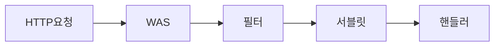
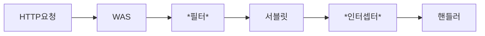

# springMvc2_Login
스프링 MVC 2편 - 백엔드 웹 개발 활용 기술 - (로그인 처리)

쿠키는 브라우저에 담겨, 모든 요청이 있을 때마다 서버도 전달된다.


**쿠카는 영속쿠키와 세션쿠키가 있다**

- **영속 쿠키** : 만료 날짜를 입력하면 해당 날짜까지 유지된다.

- **세션 쿠키** : 만료 날짜를 생략하면 브라우저 종료시 까지만 유지된다.<br>브라우저 종료시 로그아웃이 되길 기대하므로, 우리에게 필요한 것은 **세션 쿠키**이다.??

    이상하네 우리는 요청 할 때마다 연장되는거였으니까 세션쿠키가 아니라 영속쿠키를 한거아냐???????


그렇다면 로그인과 로그아웃 처리를 Cookie를 통해 해보자

##### LoginController.java

```java
// 로그인
Cookie idCookie = new Cookie("memberId", String.valueOf(loginMember.getId()));
httpResponse.addCookie(idCookie);

// 로그아웃
@PostMapping("/logout")
public String logout(HttpServletResponse response){
  expireCookie(response, "memberId");
  return "redirect:/";
}

private void expireCookie(HttpServletResponse response, String cookieName) {
  Cookie cookie = new Cookie("memberId", null);
  cookie.setMaxAge(0); // 해당 쿠키의 종료날짜를 0으로 지정한다.
  response.addCookie(cookie);
}
```


하지만 저렇게 쿠키값으로만 로그인 로그아웃을 한다면, <br>쿠키는 값을 임의로 변경할 수 있기때문에 다른 사용자로도 변신할 수 있다.


#### 대안 [세션] 이용하기

1. 쿠키에 중요한 값을 노출시키지 않고 **예측 불가능한 임의의 토큰**값을 노출한다.
2. 서버에서 토큰값을 사용자id와 매핑해서 인식한다.<br>단, 토큰은 만료시간을 짧게 유지한다(30분)
3. 토큰은 해당 서버에서 관리한다.


세션을 어떻게 할 것인지 전체 개념을 이해해보자

1. 사용자가 loginId, password를 전달하면, 서버는 해당 사용자가 맞는지 확인을 한다.


<br><br>2. 해당 사용자가 맞을 경우 **UUID**라는 랜덤값을 생성하여 세션저장소에 담아둔다.<br>생성된 **세션ID**와 세션에 보관할 값(**Member객체**)을 세션 저장소에 보관한다.

- Cookie: **mySessionId**=zz0101xx-bab9-4b92-9b32-dadb280f4b61


<br><br>3. sessionId를 담아 쿠키로 전달한다.

- **클라이언트와 서버는 결국 쿠키로 연결이 되어야 한다**


<br><br>

 여기서 중요한 포인트는 **회원과 관련된 정보는 클라이언트에 전달하지 않는것**<br>또한, **추정 불가능한 세션 ID**만 쿠키를 통해 **클라이언트**에 전달한다.

4.  로그인 이후
   - 클라이언트의 요청 시 항상 sessionId를 전달한다.
   - 서버에서는 클라이언트가 전달한 sessionId 쿠키정보로<br>세션 저장소를 조회해서 로그인 시 보관한 세션 정보를 사용한다.


**정리**

세션저장소에 sessionId(uuid)를 저장하고 sessionId(uuid)만을 클라이언트 브라우저에 저장할 경우<br> 아래와 같은 보안문제들을 해결할 수 있다.

| 문제                                                         | 해결                                                         |
| ------------------------------------------------------------ | ------------------------------------------------------------ |
| 쿠키 값 변조 가능                                            | 예상 불가능한 복잡한 세션Id를 사용                           |
| 쿠키를 보관하는 정보는 클라이언트 해킹 시 털릴 가능성이 있다. | 세션Id에는 중요한 정보가 없다.                               |
| 쿠키 탈취 후 사용                                            | 세션 만료시간을 30분 정도로 짧게 유지하고<br>클라이언트 요청이 있을 때마다 유지시간을 연장한다.<br>또한, 해킹이 의심되는 경우 세션을 강제로 제거한다. |


-----


세션관리는 크게 3가지로 나뉜다.

1. 세션 생성
   - sessionId 생성 (임의의 추정 불가능한 랜덤 값)
   - 세션 저장소에 sessionId와 보관할 값을 저장
2. 세션 조회
   - 클라이언트가 요청한 sessionId쿠키의 값으로, 세션저장소에 보관할 값 조회
3. 세션 만료
   - 클라이언트가 요청한 sessionId쿠키의 값으로, 세션 저장소에 보관한 **sessionId 값 제거**


-----

Servlet이 제공하는 **HttpSession**을 사용하여 만들어보자

HttpSession을 사용하면 Cookie이름이 **JSEESSIONID**으로 값은 불가능한 랜던값이 생성된다.

```log
Cookie: JSESSIONID=5B78E23B513F50164D6FDD8C97B0AD05
```


### 1. 세션 생성

```java
HttpSession session = request.getSession(true); // defalt가 true
session.setAttribute(SessionConst.LOGIN_MEMBER, loginMember);
```

| 구분                      | 세션 O 반환값 | 세션 X 반환값 |
| ------------------------- | ------------- | ------------- |
| request.getSession(true)  | 기존 세션     | 새로 생성     |
| request.getSession(false) | 기존 세션     | Null          |


````java
@PostMapping("/login")
public String login(@Valid @ModelAttribute LoginForm loginForm, BindingResult bindingResult, HttpServletRequest request){
  if(bindingResult.hasErrors()){
    return "login/loginForm";
  }

  Member loginMember = loginService.login(loginForm.getLoginId(), loginForm.getPassword());

  if(loginMember == null){
    bindingResult.reject("loginFail", "아이디 또는 비밀번호가 맞지 않습니다.");
    return "login/loginForm";
  }

  HttpSession session = request.getSession(true); // defalt가 true
  session.setAttribute(SessionConst.LOGIN_MEMBER, loginMember);

  return "redirect:/";
}
````


### 2. Home 진입 시 Session 가져오기

```java
HttpSession session = request.getSession(false);
if(session == null){
  return "home";
}

Member member = (Member) session.getAttribute(SessionConst.LOGIN_MEMBER);
```

위 5줄 짜리 소스를 아래 어노테이션으로 한번에 처리 가능하다

```java
public String homLogin4(
  @SessionAttribute(name = SessionConst.LOGIN_MEMBER, required = false) Member member
  , Model model){
```


```java
@GetMapping("/")
public String homLogin4(
  @SessionAttribute(name = SessionConst.LOGIN_MEMBER, required = false) Member member, Model model){

  //        // Home화면 진입이기때문에
  //        // 세션을 생성할 의도가 없기에 getSssion(false)로 지정해줘야한다.
  //        HttpSession session = request.getSession(false);
  //        if(session == null){
  //            return "home";
  //        }
  //
  //        Member member = (Member) session.getAttribute(SessionConst.LOGIN_MEMBER);

  if(member == null){
    return "home";
  }

  if(member == null){
    return "home";
  }

  model.addAttribute("member", member);
  return "loginHome";
}
```


### 3. 세션 만료

- HttpSession session = request.getSession(false);
- session.invalidate();

```java
@PostMapping("/logout")
public String logout3(HttpServletRequest request){
  HttpSession session = request.getSession(false);
  if(session != null){
    session.invalidate(); // 무효화하다 invalidate
  }
  return "redirect:/";
}
```


그런데 URL에 JSESSIONID로 아래와 같이 들어오기때문에 <br>브라우저에서 쿠키를 지원하지 않는 경우로 만들어진 것이다.


Application.properties에 다음 내용을 넣어주자

```java
server.servlet.session.tracking-modes=cookie
```


--------------


```java
- 영속쿠키
- 세션쿠키
- Cookie cookie = new Cookie(“memberId”, String.valueOf(loginMember.getId());  
           HttpResponse.addCookie(cookie);
  - Cookie cookie = new Cookie(“memberId”, null);
       cookie.setMaxAge(0);
       response.addCookie(cookie);

 - 세션
1. 세션 생성
  HttpSession session = request.getSession(true); // defalt가 true
  session.setAttribute(SessionConst.LOGIN_MEMBER, loginMember);

 2. 세션만료
  HttpSession session = request.getSession(false);
  if(session != null){
    session.invalidate(); // 무효화하다 invalidate
  }

3. 세션가져오기
HttpSession session = request.getSession(false);
Member member = (Member) session.getAttribute(SessionConst.LOGIN_MEMBER);
   ===> @SessionAttribute(name = SessionConst.LOGIN_MEMBER, required = false) Member member
```

------------------

세션
### 로그인 처리 - 필터, 인터셉터

대부분의 Controller 로직에는 공통으로 **로그인 여부**를 체크해야한다.<br> 이때 사용되는것이 바로 필터이다.

필터는 Servlet에서 제공해주고, Interceptor는 Spring에서 제공해준다.<br>또한, HttpServletRequest를 제공해준다

우선 필터부터 알아보자,

## 1. 필터

**필터 흐름**



필터를 적용하면 서블릿 이전에 필터가 먼저 호출된다.

만약 Filter에 로그인 체크하는 기능이 있다면, <br>로그인 하지 않은 사용자의 경우 필터까지만 호출되고 서블릿을통해 해당Controller로 진입 못하도록 막을 수 있다.


**필터 인터페이스**

```java
public interface Filter {
  public default void init(FilterConfig filterConfig) throws ServletException {}

  public void doFilter(ServletRequest request, ServletResponse response,
                       FilterChain chain) throws IOException, ServletException;

  public default void destroy() {}
}
```

- Init() : 필터 **초기화 메서드**로, **서블릿 컨테이너가 생성**될 때 **호출**된다.
- doFilter() : **고객의 요청이 들어올 때마다 호출, 필터의 로직을 구현**해야한다.
- destroy() : **필터 종료 메서드**로, **서블릿컨테이너가 종료**될 때 호출된다.

> 필터인터페이스를 구현하여 등록하면, 스프링컨테이너에서 **싱글톤 객체**로 생성하고 관리한다.


- WebConfig에서 FilterRegistrationBean을 통해 LoginFilter, LoginCheckFilter를 싱글톤으로 스프링컨테이너에 FilterBean으로 등록해놓았다.

- LogFilter가 setOrder(1)로 지정하였기에 먼저 실행이되고

  - Chain.doFilter를 통하여 다음 Filter인 LoginCheckFilter가 실행된다

    - session이 없는 경우 httpResponse.sendRedirect("/login**?redirectURL="+requestURI**)<br>?redirectURL=requestURL을 통해 해당 로그인 후 처음 요청했던 URL로 이동시켜준다.

      - ```java
        @PostMapping("/login")
        public String login4(@Valid @ModelAttribute LoginForm loginForm, BindingResult bindingResult,
                             @RequestParam(defaultValue= "/") String redirectURL
                             , HttpServletRequest request){
           .... 생략 ....
        
          return "redirect:"+redirectURL;
        }
        ```

      - 

    - ```java
      /**
      * 화이트 리스트의 경우 인증 체크X
      * 아래 매치를 통해 URL 체크를 하여 chain.doFilter를 실행한다.
      * 아래 URL들은 login을 체크할 필요가 없다.
      */
      private static final String[] whitelist = {"/", "/members/add", "/login", "/logout", "/css/*"};
      
      private boolean isLoginCheckPath(String requestURI){
      	return !PatternMatchUtils.simpleMatch(whitelist, requestURI);
      }
      ```


-------

## 2. 인터셉터

**스프링 인터셉터 흐름**



- 필터는 Servlet에서 제공해주기에 DispatcherServlet이전에 실행되지만,<br>인터셉터의 경우 SpringMVC에서 제공해주기때문에 DispatcherServlet실행 후 실행된다.

- 인터셉터 역시 Chain형식으로 실행할 수 있기에Filter처럼 Log기능을 넣고, 로그인체크를 할 수 있다.

<br>

**스프링 인터셉터 인터페이스**

```java
public interface HandlerInterceptor {
  // boolean return
  default boolean preHandle(HttpServletRequest request, HttpServletResponse response, 															Object handler)
    throws Exception {
    return true;
  }
 
  // Parameter : @Nullable ModelAndView modelAndView
	default void postHandle(HttpServletRequest request, HttpServletResponse response, 															Object handler, @Nullable ModelAndView modelAndView) 
    throws Exception {}
  
  // Parameter : @Nullable Exception ex
  default void afterCompletion(HttpServletRequest request, HttpServletResponse response, 													Object handler, @Nullable Exception ex) throws Exception {}
}
```

- preHandle : handlerAdaptor 이전에 호출되어, boolean을 return해주기때문에<br> true : handlerAdaptor호출O <br>false : handlerAdaptor호출X
- postHandle : handlerAdaptor이후 controller까지 호출되고 나서 실행<br> Controller에 Exception이 터지면 실행하지않는다
- afterCompletion : handlerAdaptor, controller, view까지 렌더링되고 나서 실행된다.<br>Parameter로 Exception을 받아들이기에 controller에서 오류가 터져도 실행이 되고 어떤오류가 났는지 log를 찍을 수 있다.


- 스프링 controller에서 Exception발생 시 **postHandler실행X** **afterCompletion 실행O**


우선, Filter가 먼저 실행이 되고 Interceptor가 실행되는지 확인해보자


- LogFilter가 먼저 실행되고

  - 그 안에 loginCheckFilter
    - 그 안에 Interceptor가 실행된다.

  


- 재미있는 점은 model에 setAttribute한 내용들도 postHandler에서 확인 가능하다
  - preHandle
    - boolean으로 다음 controller 로직 실행여부를 결정하고
    - handle로 어떤 Controller의 어떤 method를 호출하였는지 확인도 가능하다.
      - handle 찍어보면  hello.login.web.item.ItemController#items(Model)
  - postHandle
    - controller Exception 터졌을 경우 실행X
    - ModelAndView return 해주는데 setAttribute한 내용들도 표시해준다.
      - [ModelAndView <br>.       [. view="items/items"; <br>.          model={items=[Item(id=1, itemName=itemA, price=10000, quantity=10), <br>                        Item(id=2, itemName=itemB, price=20000, quantity=20)<br>        ]


##### 필터와 인터셉터의 비교

필터는 doFilter만으로 dispatcherServlet실행 전 으로만 사용가능하지만<br>인터셉터는 SpringMvc에서 나온 기능으로 DispatcherServlet실행 후 동작하기때문에 아래처럼 상세하게 설정 가능하다.<br> - preHandle handlerAdaptor 호출 전<br> - postHandle handlerAdaptor 호출 후<br> - afterCompletion handlerAdaptor, View까지 렌더링 되고 난후

또한, interceptor와 Filter를 설정한 내용을 보면 

interceptor는 WebMvcConfigurer을 이용하여 상속받은 addInterceptors메소드를 통해<br> **excludePathPatterns**으로 제외 url도 설정 가능하다. 

또한 Filter보다 소스도 간결하다

```java
import org.springframework.web.servlet.config.annotation.WebMvcConfigurer;
import javax.servlet.Filter;

@Configuration
public class WebConfig implements WebMvcConfigurer {

    @Override
    public void addInterceptors(InterceptorRegistry registry) {
        registry.addInterceptor(new LogInterceptor())
                .order(1)
                .addPathPatterns("/**")
                .excludePathPatterns("/css/**", "/*.ico", "/error");

        registry.addInterceptor(new LoginInterceptor())
                .order(2)
                .addPathPatterns("/**") // 모든 경로를 허용하지만, 
          															// excludePathPatterns로 아래 경로는 제외
                .excludePathPatterns("/", "/members/add", "/login", "/logout"
                                    , "/css/**", "/*.ico", "/error");
                // interceptor는 패턴을
                // 상세하게 할 수 있다.
    }

    // 스프링 컨테이너에 해당 Filter를 등록해준다.
    @Bean
    public FilterRegistrationBean logFilter(){
        FilterRegistrationBean<Filter> filterFilterRegistrationBean = new FilterRegistrationBean<>();
        filterFilterRegistrationBean.setFilter(new LogFilter()); // Filter등록
        filterFilterRegistrationBean.setOrder(1); // 순서 정의[작을수론 먼저 호출됨]
        filterFilterRegistrationBean.addUrlPatterns("/*"); // 요청 URL
        return filterFilterRegistrationBean;
    }

    @Bean
    public FilterRegistrationBean loginCheckFilter(){
        FilterRegistrationBean<Filter> filterFilterRegistrationBean = new FilterRegistrationBean<>();
        filterFilterRegistrationBean.setFilter(new LoginCheckFilter());
        filterFilterRegistrationBean.setOrder(2);
        filterFilterRegistrationBean.addUrlPatterns("/*"); // 화이트리스트 넣어주었기에 그냥 들어감
        return filterFilterRegistrationBean;
    }
}
```


------


## @Login ArgumentResolver 만들기


```java
HomeController
  - @Login Member member
  @Interface Login
  - @Target(ElementType.PARAMETER) 
  - @Retention(RetentionPolicy.RUNTIME)

LoginMemberArgumentResolver implements HandlerMethodArgumentResolver
  - supportsParameter
  - parameter.hasParameterAnnotation(Login.class);
  - Member.class.isAssignableFrom(parameter.getParameterType());
  - resolveArgument

WebMvcConfigurer
  @Override
  public void addArgumentResolvers(List<HandlerMethodArgumentResolver> resolvers) {
  resolvers.add(new LoginMemberArgumentResolver());
}
```


